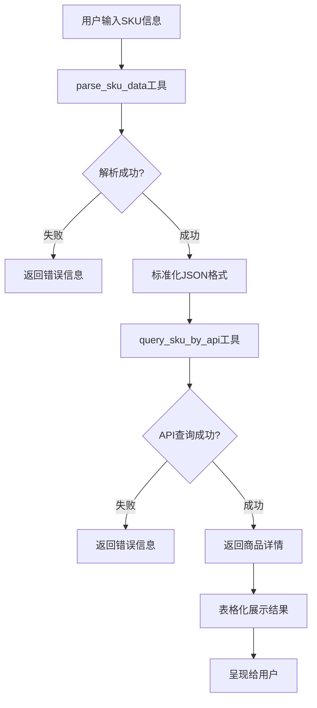

# SKU Expert Agent - 业务逻辑文档

## 概述

SKU Expert Agent（SKU专家智能体）是一个基于 Google ADK 框架构建的 AI 智能体，专门用于处理 SKU（库存单位）信息的解析和查询。该智能体能够理解多种格式的 SKU 输入，并将其转换为标准化格式，然后通过 ERPNext API 查询商品详情。

## 核心功能

### 1. SKU 信息解析
- 支持三种输入格式：JSON、表格、文本
- 自动识别和转换不同格式的 SKU 数据
- 数据验证和错误处理

### 2. SKU 信息查询
- 通过 ERPNext API 批量查询商品详情
- 返回完整的商品信息（包括 item_code、item_name、item_group 等）
- 错误处理和超时控制

## 业务工作流



### 详细步骤

1. **数据解析阶段**
   - 用户提供 SKU 信息（可以是表格、文本或 JSON 格式）
   - Agent 调用 `parse_sku_data` 工具解析输入
   - 工具自动识别输入格式并转换为标准 JSON 格式
   - 返回包含 `items` 数组的结构化数据

2. **数据查询阶段**
   - Agent 将解析后的数据转换为 JSON 字符串
   - 调用 `query_sku_by_api` 工具查询商品详情
   - 工具向 ERPNext API 发送 POST 请求
   - 返回查询结果（包含找到/未找到的商品信息）

3. **结果呈现阶段**
   - Agent 分析查询结果
   - **以Markdown表格形式展示查询结果**
   - 表格必须包含以下列：
     - 查找状态（found字段）：使用 ✅ 已找到 或 ❌ 未找到 标识
     - SKU代码（sku_code）
     - 颜色（color）
     - 商品代码（item_code，found=true时显示，found=false时显示'-'）
     - 商品名称（item_name，found=true时显示，found=false时显示'-'）
     - 商品分组（item_group，found=true时显示，found=false时显示'-'）
   - 在表格下方提供查询摘要（总计、找到数量、未找到数量）
   - 对找到的商品展示完整的商品信息
   - 对未找到的商品（found=false）明确标识未找到状态

## 工具详解

### parse_sku_data

**功能**：解析 SKU 信息并转换为标准化 JSON 格式

**支持的输入格式**：

1. **JSON 格式**
   ```json
   {
     "items": [
       {"sku_code": "IW-10200 涤粘弹面料", "color": "黑棕格"}
     ]
   }
   ```
   或直接数组格式：
   ```json
   [
     {"sku_code": "IW-10200 涤粘弹面料", "color": "黑棕格"}
   ]
   ```

2. **表格格式**
   ```
   品类	颜色
   IW-10200 涤粘弹面料	黑棕格
   zNF-16-RED	红
   ```
   支持的分隔符：制表符（\t）、双空格、竖线（|）、逗号（,）

3. **文本格式**
   ```
   品类：IW-10200 涤粘弹面料，颜色：黑棕格
   品类：zNF-16-RED，颜色：红
   ```

**输出格式**：
```json
{
  "status": "success",
  "data": {
    "items": [
      {
        "sku_code": "IW-10200 涤粘弹面料",
        "color": "黑棕格"
      }
    ]
  }
}
```

**数据验证规则**：
- `sku_code`（品类）字段不能为空
- `color`（颜色）字段不能为空
- 支持部分数据验证失败的情况（会返回警告信息）

### query_sku_by_api

**功能**：调用 ERPNext API 查询 SKU 信息

**输入参数**：
- `items_json`（str）：JSON 字符串格式的 SKU 数据
  - 格式1：`'{"items": [{"sku_code": "...", "color": "..."}]}'`
  - 格式2：`'[{"sku_code": "...", "color": "..."}]'`

**API 配置**：
- 基础 URL：从环境变量 `ERPNEXT_API_BASE_URL` 读取（默认：`http://127.0.0.1:8123`）
- 端点路径：从环境变量 `ERPNEXT_API_ENDPOINT` 读取
- 请求方法：POST
- 请求头：`accept: application/json`, `Content-Type: application/json`
- 超时时间：5 秒

**API 请求格式**：
```json
{
  "data": {},
  "json_data": {
    "items_data": [
      {
        "sku_code": "IW-10200 涤粘弹面料",
        "color": "黑棕格"
      }
    ]
  }
}
```

**API 响应格式**：
```json
{
  "data": {
    "message": [
      {
        "found": true,
        "sku_code": "zNF-16-RED",
        "color": "红",
        "item_code": "zNF-16-RED",
        "item_name": "zNF-16-RED",
        "item_group": "面料",
        "stock_uom": "米",
        ...
      }
    ]
  }
}
```

**输出格式**：
```json
{
  "status": "success",
  "results": [
    {
      "found": true,
      "sku_code": "...",
      "color": "...",
      "item_code": "...",
      "item_name": "...",
      ...
    }
  ]
}
```

**结果展示**：
- Agent会将查询结果格式化为Markdown表格展示给用户
- 表格必须包含found字段（查找状态），清晰标识每个SKU是否找到
- found=true的行显示完整的商品信息
- found=false的行，商品信息列显示为"-"
- 表格下方会显示查询摘要统计信息

**错误处理**：
- JSON 解析错误：返回格式错误提示
- 网络超时：返回超时错误（5秒）
- 连接错误：返回连接失败提示
- HTTP 错误：返回 HTTP 状态码和错误信息
- 其他异常：返回通用错误信息

## 数据字段说明

### sku_code（品类）
- **说明**：完整的 SKU 品类信息
- **示例**：`"IW-10200 涤粘弹面料"`、`"zNF-16-RED"`
- **要求**：必填，不能为空
- **注意**：保留完整的品类字段内容，不进行截取

### color（颜色）
- **说明**：SKU 的颜色信息
- **示例**：`"黑棕格"`、`"红"`
- **要求**：必填，不能为空

## 使用示例

### 示例 1：表格格式输入

**用户输入**：
```
品类	颜色
IW-10200 涤粘弹面料	黑棕格
zNF-16-RED	红
```

**Agent 处理流程**：
1. 调用 `parse_sku_data` 解析表格
2. 转换为标准 JSON 格式
3. 调用 `query_sku_by_api` 查询商品详情
4. 将查询结果格式化为Markdown表格展示

**示例输出表格**：
```markdown
| 查找状态 | SKU代码 | 颜色 | 商品代码 | 商品名称 | 商品分组 |
|---------|---------|------|----------|----------|----------|
| ✅ 已找到 | zNF-16-RED | 红 | zNF-16-RED | zNF-16-RED | 面料 |
| ❌ 未找到 | IW-10200 涤粘弹面料 | 黑棕格 | - | - | - |

**查询摘要**：
- 总计：2个SKU
- 已找到：1个
- 未找到：1个
```

### 示例 2：文本格式输入

**用户输入**：
```
品类：IW-10200 涤粘弹面料，颜色：黑棕格
```

**Agent 处理流程**：
1. 调用 `parse_sku_data` 解析文本
2. 提取品类和颜色信息
3. 转换为标准 JSON 格式
4. 调用 `query_sku_by_api` 查询商品详情
5. 将查询结果格式化为Markdown表格展示

### 示例 3：JSON 格式输入

**用户输入**：
```json
{
  "items": [
    {"sku_code": "IW-10200 涤粘弹面料", "color": "黑棕格"}
  ]
}
```

**Agent 处理流程**：
1. 直接解析 JSON 格式
2. 验证数据格式
3. 调用 `query_sku_by_api` 查询商品详情
4. 将查询结果格式化为Markdown表格展示

## 环境配置

### 必需的环境变量

在 `.env` 文件中配置以下环境变量：

```env
GOOGLE_GENAI_USE_VERTEXAI=FALSE
GOOGLE_API_KEY=your-api-key-here
ERPNEXT_API_BASE_URL=http://127.0.0.1:8123
ERPNEXT_API_ENDPOINT=/erpnext/resource?endpoint=%2Fapi%2Fmethod%2Frongguan_erp.utils.api.item.item_api_for_agent.get_items_by_sku_and_color&method=POST&full_model_fields=true
```

### 环境变量说明

- `GOOGLE_API_KEY`：Google AI Studio API 密钥（必需）
- `ERPNEXT_API_BASE_URL`：ERPNext API 基础 URL（可选，默认：`http://127.0.0.1:8123`）
- `ERPNEXT_API_ENDPOINT`：ERPNext API 端点路径（可选，默认值见上方）

## Agent 配置

### 模型
- **模型名称**：`gemini-2.5-flash`
- **模型类型**：Google Gemini 模型

### Agent 指令
Agent 被配置为：
- 友好地与用户交互
- 清晰地向用户说明输入格式要求
- **以Markdown表格形式展示查询结果**
- **表格必须包含found字段（查找状态），清晰标识哪些SKU找到了，哪些未找到**
- 对于找到的SKU展示完整商品信息，对于未找到的SKU显示查询信息和未找到状态
- 在表格下方提供查询摘要统计信息
- 明确地告知错误原因和建议

## 错误处理策略

### 解析错误
- **原因**：输入格式无法识别
- **处理**：返回友好的错误提示，说明支持的格式
- **建议**：用户按照提示的格式重新输入

### API 查询错误
- **原因**：网络问题、API 服务器问题等
- **处理**：返回具体的错误信息（超时、连接失败、HTTP 错误等）
- **建议**：检查网络连接和 API 服务器状态后重试

### 部分数据错误
- **原因**：部分 SKU 数据格式不正确
- **处理**：继续处理有效数据，返回警告信息
- **建议**：检查错误的数据项，修正后重新处理

### 未找到商品
- **原因**：API 返回 `found: false`
- **处理**：明确告知用户哪些 SKU 未找到
- **建议**：检查 SKU 代码和颜色是否正确

## 技术架构

### 技术栈
- **框架**：Google ADK (Agent Development Kit)
- **语言**：Python 3.10+
- **HTTP 客户端**：requests 库
- **JSON 处理**：Python 标准库 json

### 项目结构
```
sku_expert_agent/
├── __init__.py              # 包初始化
├── agent.py                 # Agent 定义
├── tools/                   # 工具目录
│   ├── __init__.py
│   ├── sku_parser.py       # SKU 解析工具
│   └── sku_api.py          # SKU 查询 API 工具
├── .env                     # 环境变量配置
├── .env.example            # 环境变量示例
└── readme.md               # 本文档
```

## 运行方式

### 开发模式

使用 ADK Web UI 进行开发和测试：

```bash
cd apps/chat-agent
adk web
```

然后在浏览器中访问 `http://localhost:8000`，选择 `sku_expert_agent` 进行交互。

### 命令行模式

```bash
cd apps/chat-agent
adk run sku_expert_agent
```

### API 服务器模式

```bash
cd apps/chat-agent
adk api_server
```

## 注意事项

1. **API 密钥安全**：确保 `.env` 文件不被提交到版本控制系统
2. **网络连接**：确保能够访问 ERPNext API 服务器
3. **数据格式**：输入的 SKU 数据必须包含 `sku_code` 和 `color` 两个字段
4. **API 超时**：API 请求默认超时时间为 5 秒，如需调整可修改代码
5. **错误处理**：Agent 会对各种错误进行友好提示，但用户需要根据提示调整输入

## 未来改进

- [ ] 支持更多输入格式（Excel、CSV 文件等）
- [ ] 增加批量处理的性能优化
- [ ] 添加结果缓存机制
- [ ] 支持异步 API 调用
- [ ] 增加更详细的日志记录
- [ ] 支持自定义字段映射
- [ ] 增加数据导出功能
